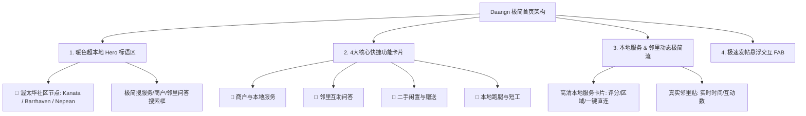

# 渥帮 (JustWeDo) Daangn 风格极简首页重构方案

## 🎯 方案宗旨与核心定位

> **“不是大而全，而是小而精、轻量、好用、好访问。”**

借鉴韩国现象级社区服务平台 **Daangn Market (당근마켓 / Karrot)** 的 UI/UX 精髓，将 **渥帮 (JWD)** 首页重新打造为**“渥太华华人社区生活服务平台”**（商户服务 + 邻里互助 + 闲置流转）。

---

## 🎨 设计语言与色彩体系 (Daangn Design System)

- **品牌色彩 (Color Palette)**：
  - **主 Accent 色**：胡萝卜暖橙 (`#FF6F0F` / `#FF7E36`) + 极简柔和淡暖灰 (`#FAFAFA`)。
  - **对比度与阴影**：大面积纯白卡片，配柔和圆角 (`rounded-2xl`) 与微阴影，零视觉杂讯。

---

## 🛠️ 首页版块重构方案 (Component Breakdown)

### 1. 暖色超本地 Hero ([BentoHero.tsx](file:///d:/MYAPP/Justwedo/src/components/home/BentoHero.tsx))
- **设计重点**：从原本复杂的 Bento 拼接，重构为 **Daangn 式超本地暖心 Header**。
- **文案**：
  - 主标题：**“📍 渥太华华人社区生活服务”**
  - 副标题：**“商户服务 · 邻里互助 · 二手闲置 · 靠谱生活帮助”**
- **功能**：
  - 核心社区节点切选（Kanata Lakes / Barrhaven / Nepean / Downtown）。
  - 大字号极简搜索框：`搜索家政清洁、维修、铲雪或邻里问答...`

### 2. 4大核心极简分类入口 ([CategoryIconGrid.tsx](file:///d:/MYAPP/Justwedo/src/components/home/CategoryIconGrid.tsx))
放弃过去冗长的十几目菜单，提炼为 **4 大超级大图标入口**：
1. 🧹 **商户与本地服务** (Local Pros & Services)：清洁保洁、水电维修、铲雪割草、接送协助。
2. 🤝 **邻里互助问答** (Community Q&A / JustTalk)：求助问答、邻里推荐、本地经验。
3. 🎁 **二手闲置与赠送** (Free Sharing & Goods)：邻里闲置买卖、免费送 (Na-num)。
4. 💼 **本地跑腿与短工** (Local Gigs & Tasks)：临时小忙、求助协助。

### 3. 本地服务 & 邻里动态流 ([Index.tsx](file:///d:/MYAPP/Justwedo/src/pages/Index.tsx))
- **精简板块数量**：将原先 5-6 个重度加载的列表精简为 2 个高粘性 Feeding 区：
  - **🔥 渥太华靠谱服务商 (Recommended Local Services)**：高清展示服务商头像、服务类别、评价得分、服务区域（如 Kanata）与“直接沟通”按钮。
  - **💬 邻里最新动态 (Neighborhood Life Feed)**：瀑布流/简洁列表展示邻居最新发帖、问答与求助。

### 4. 极速悬浮发布按钮 (Floating Action Button - FAB)
- 移动端底部与桌面端右下角增加极简悬浮 `+ 发布需求/服务` 按钮，一键调出轻量发帖弹窗。
